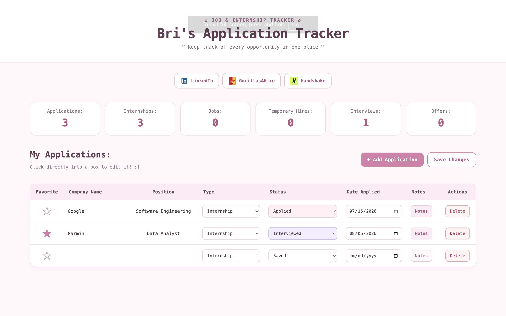
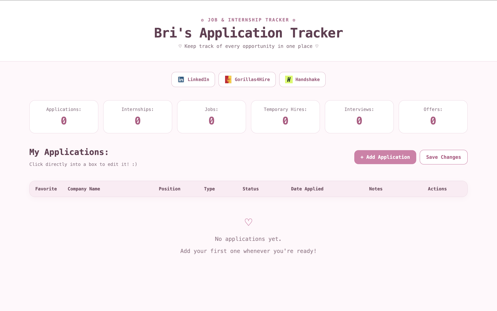

# Application Tracker

Application Tracker is a simple web app I built to keep track of jobs, internships, and other opportunities.

## Live Demo

[View the Application Tracker](https://itzzthebri.github.io/Application-Tracker/)

## Screenshots

### Sample Data

### Clean Startup

## Features

- Add and edit applications
- Track company, position, status, and other details
- Delete applications with a confirmation popup
- Save application data in the browser

## Built With

- HTML
- CSS
- JavaScript

## What I Learned

This project helped me get more practice with JavaScript, local storage, forms, event listeners, and organizing a larger front-end project.

## Future Ideas

- Search and filtering
- Sorting by status or date
- Deadlines and reminders
- Better mobile support

## Author

Brianna Boucher
